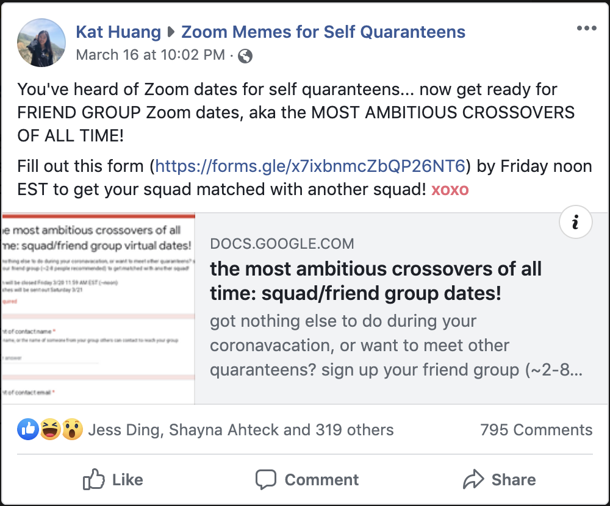
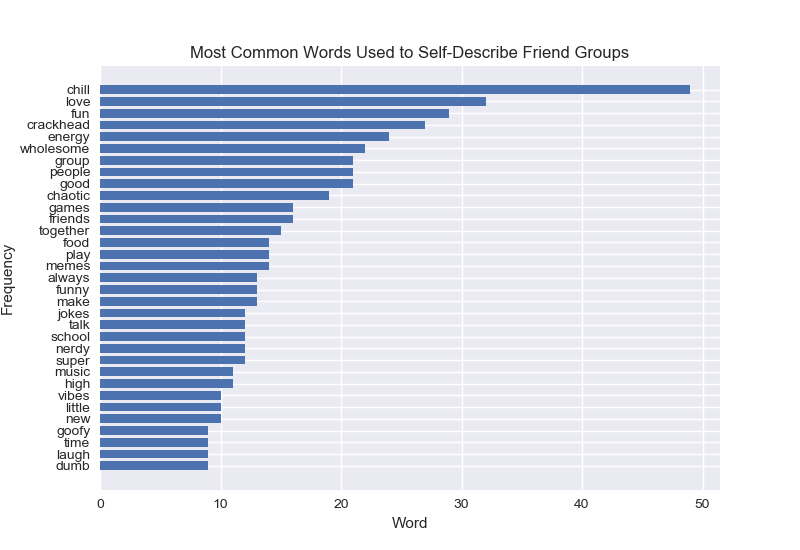
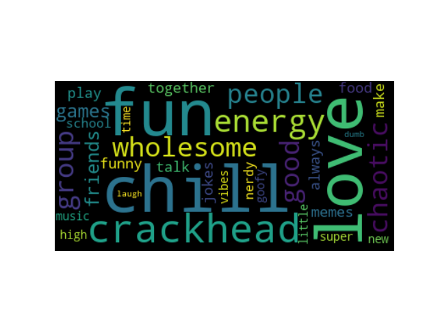

# Squad Dates

I got an idea

So I implemented the idea

We ended up getting:

- 228 distinct friend groups
- 125 schools represented

We manually made all the matches and then sent them out using [this script](email_script_public.js)

Thank you to my squad, especially Shayna for letting me borrow multiple of their Gmail accounts to get around the email rate limit